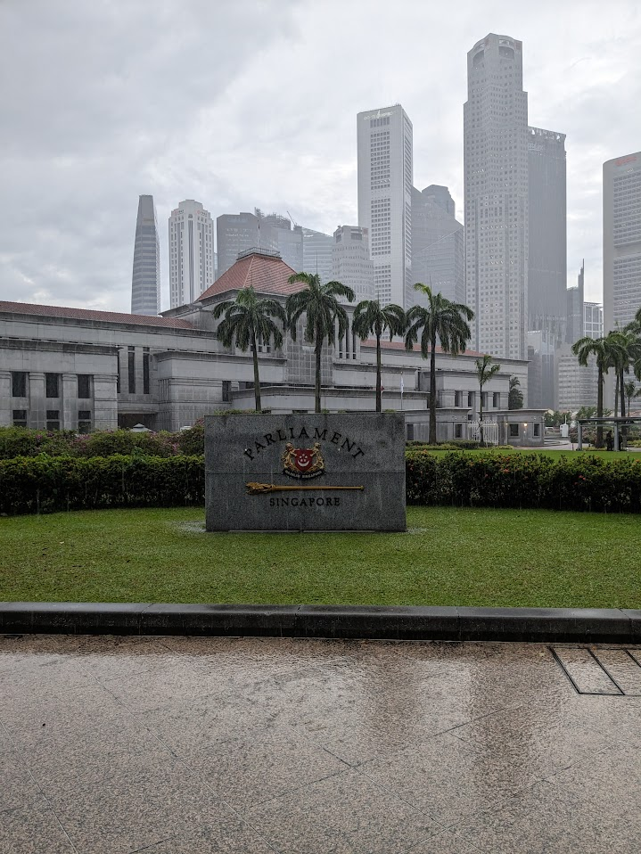
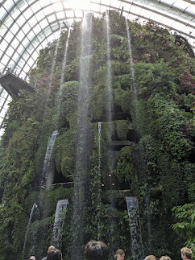
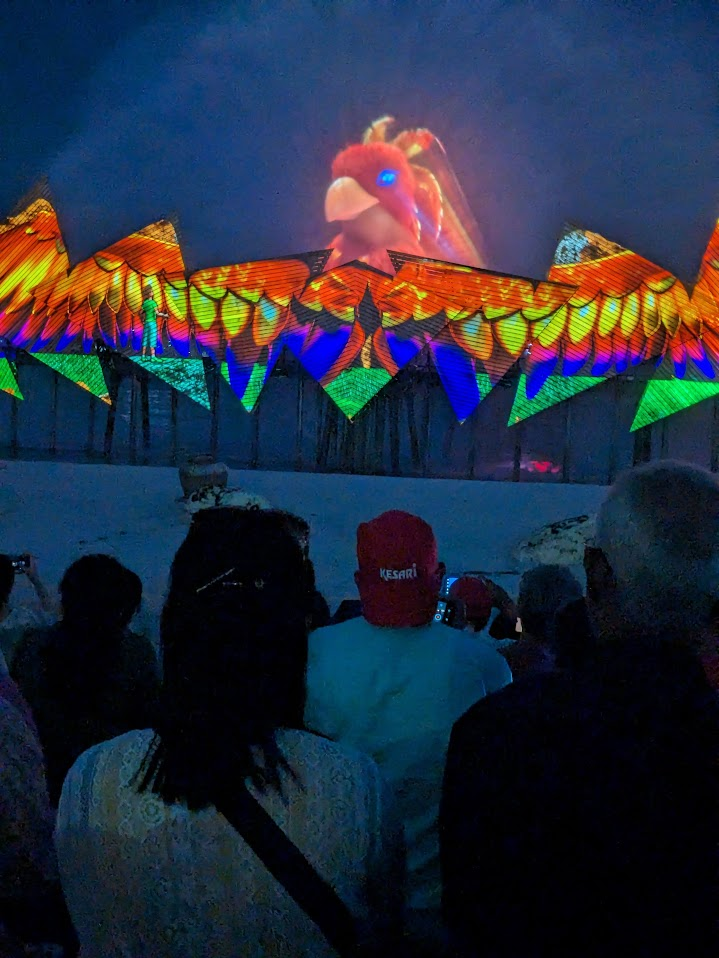

        
The internet is filled with travel destinations, but Singapore stands out as one of the best places to visit in Asia. Known for its modern skyline, cultural diversity, and world-class attractions, Singapore offers a perfect mix of technology, tourism, food, and entertainment.

**Financial District**

Walking through Singapore’s financial district feels like stepping into the future. Surrounded by sleek skyscrapers, luxury hotels, and bustling professionals, this area reflects the city’s status as a global financial hub.

The skyline—especially at night—is one of the most iconic views in the world and a must-see for anyone visiting Singapore.

**Merlion Park: The Icon of Singapore**

No trip to Singapore is complete without visiting the famous Merlion. With the body of a fish and the head of a lion, it represents Singapore’s origins as a fishing village and its rise as a global city.

This spot offers some of the best photo opportunities in Singapore, especially during sunset.

**Little India: A Burst of Colors and Culture**

Little India is one of the most vibrant neighborhoods in Singapore. Filled with colorful streets, traditional shops, and temples, it offers an authentic cultural experience.

From delicious Indian cuisine to street shopping, it’s a must-visit for those who love food, culture, and local markets.

**Gardens by the Bay: A Futuristic Nature Experience**

Gardens by the Bay is one of Singapore’s most iconic attractions. The towering Supertree structures and climate-controlled domes create a surreal blend of nature and technology.

The light show in the evening is a must-watch and makes it one of the top Instagram-worthy places in Singapore.

**Chinatown: Tradition Meets Modernity**

Chinatown blends heritage with modern lifestyle seamlessly. You’ll find historic temples alongside trendy cafes and bustling street markets.

It’s the perfect place to explore Singapore’s cultural roots, try local food, and shop for souvenirs.

**Sentosa Island: The Ultimate Getaway**

Sentosa Island is Singapore’s top destination for relaxation and entertainment. With beautiful beaches, luxury resorts, and exciting attractions, it offers something for every traveler.

Whether you want to unwind or explore, Sentosa is a must-visit destination.

**Madame Tussauds Singapore: Meet the Stars**

Get up close with your favorite celebrities at Madame Tussauds Singapore. The lifelike wax figures make it a fun and interactive experience for visitors of all ages.

It’s one of the most popular indoor attractions in Singapore.

**Universal Studios Singapore: Thrills and Entertainment**

Located on Sentosa Island, Universal Studios Singapore is a paradise for thrill seekers. From exciting rides to movie-themed attractions, it offers a full day of fun and adventure.

It’s easily one of the top tourist attractions in Singapore.

Singapore is one of the most diverse and exciting travel destinations in the world. From its modern financial district to its rich cultural neighborhoods and thrilling attractions, it offers a complete travel experience.

Whether you're visiting for a short trip or a longer stay, Singapore promises unforgettable memories.